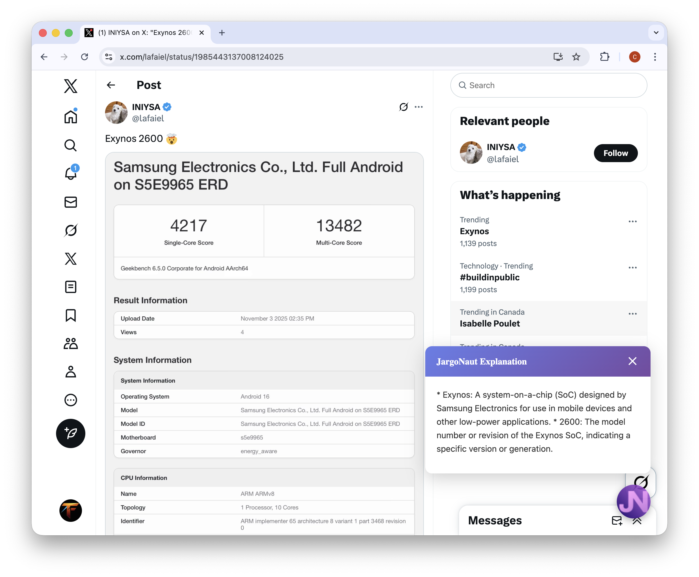
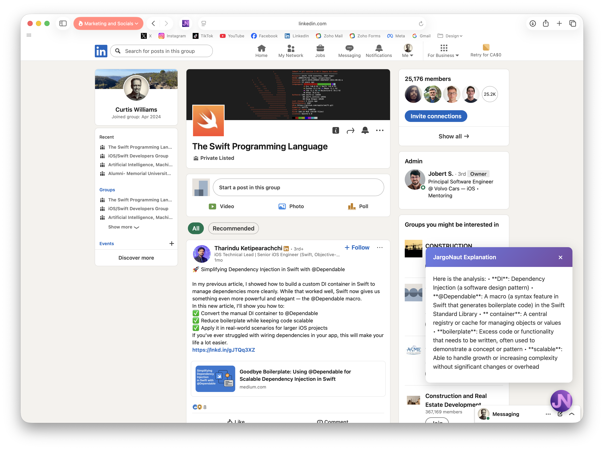

# 🧭 JargoNaut

**Navigate the jargon. Understand tech Twitter.**

A browser extension that provides instant AI-powered explanations of technical jargon on Twitter/X and LinkedIn. Built as a learning project while developing coding skills.



---

## 🎯 What is JargoNaut?

Ever scrolled through tech Twitter and seen terms like "SoC," "Exynos," or "boilerplate" and wished you had a quick way to understand them? JargoNaut adds a floating button to social media posts that, when clicked, uses AI to explain any technical jargon in plain English.

**Key Features:**
- Instant jargon detection and explanation
- Powered by AI (OpenRouter API)
- Clean, unobtrusive UI
- Free and open source
- Works on Twitter/X and LinkedIn

---

## 📸 Screenshots

### Twitter/X
<div align="center">
  
  
</div>

### LinkedIn
<div align="center">
  
  
</div>

---

## 🚀 Installation

### Chrome (Easier)

1. **Download the extension**
```bash
   git clone https://github.com/CuWilliams/jargonaut.git
   cd jargonaut
```

2. **Load in Chrome**
   - Open Chrome and go to `chrome://extensions/`
   - Enable "Developer mode" (toggle in top right)
   - Click "Load unpacked"
   - Select the `extensions/chrome` folder

3. **Get your API key**
   - Visit [OpenRouter](https://openrouter.ai/keys)
   - Sign up for a free account
   - Generate an API key
   - Click the JargoNaut extension icon
   - Paste your API key and click "Save"

4. **Start using it!**
   - Go to Twitter/X or LinkedIn
   - Find a post with technical terms
   - Click the JargoNaut button (bottom-right of posts)
   - Get instant explanations!

### Safari (Advanced - Requires Xcode)

**Note:** Safari installation requires Xcode and is more complex. Recommended for developers comfortable with macOS development tools.

1. **Prerequisites**
   - macOS 11.0 or later
   - Xcode 13.0 or later
   - Apple Developer account (free tier works)

2. **Build the extension**
```bash
   git clone https://github.com/CuWilliams/jargonaut.git
   cd jargonaut/extensions/JargoNaut\ Safari
   open JargoNaut\ Safari.xcodeproj
```

3. **In Xcode**
   - Select your development team (Xcode > Preferences > Accounts)
   - Build and run the project (⌘R)
   - The app will open with instructions

4. **Enable in Safari**
   - Open Safari > Preferences > Extensions
   - Enable "JargoNaut Extension"
   - Grant necessary permissions

5. **Configure API key**
   - Click the JargoNaut icon in Safari toolbar
   - Follow the same API key setup as Chrome

---

## 💡 Why I Built This

I'm learning to code, and I kept running into technical jargon on Twitter that I didn't understand. Rather than constantly Googling terms, I decided to build a tool that would explain them in context. This project has been my hands-on introduction to:

- Browser extension development (Chrome & Safari)
- API integration
- JavaScript, HTML, CSS
- Swift basics (for Safari)
- Git and version control
- Prompt engineering for AI

**Learning in public:** This is a learning project, and I'm sharing it openly. The code isn't perfect, but it works! I've documented my journey, including the app store rejections that led me to pivot to open source.

**Built with AI assistance:** This project was developed with significant help from Claude AI. As a beginner, having an AI coding assistant was invaluable for learning best practices, debugging, and understanding new concepts. I believe AI tools are powerful learning accelerators when used thoughtfully.

---

## 🛠️ Tech Stack

- **Frontend:** Vanilla JavaScript, HTML5, CSS3
- **Chrome:** Manifest V3 extension API
- **Safari:** Safari Web Extensions
- **AI Provider:** OpenRouter API (meta-llama/llama-3.2-3b-instruct:free)
- **Version Control:** Git/GitHub
- **Development:** VS Code, Xcode

---

## 📋 How It Works

1. **Content script injection:** When you visit Twitter/X or LinkedIn, JargoNaut injects a content script
2. **Button placement:** A floating button appears on each post
3. **Text extraction:** When clicked, the extension extracts the post text
4. **AI analysis:** Text is sent to OpenRouter's API with a specialized prompt
5. **Smart explanation:** AI identifies jargon and provides concise explanations
6. **Display:** Results appear in a clean popup overlay

---

## 🔑 API Key & Privacy

**OpenRouter Free Tier:**
- The free tier is sufficient for casual use
- Rate limits apply (check OpenRouter's documentation)
- No credit card required for free tier

**Privacy:**
- Your API key is stored locally in your browser
- Post text is only sent to OpenRouter when you click the button
- No data is collected or stored by JargoNaut
- Open source = you can verify everything yourself

---

## 🤝 Contributing

I'd love your help making JargoNaut better! This is a learning project, so contributions of all skill levels are welcome.

**Ways to contribute:**
- Report bugs via [GitHub Issues](https://github.com/CuWilliams/jargonaut/issues)
- Suggest features or improvements
- Improve documentation
- Submit pull requests
- Star the repo to show support

**Good first issues:**
- Improve AI prompt for better jargon detection
- Add dark mode support
- Improve error handling and user feedback
- Add keyboard shortcuts
- Support for additional platforms (Reddit, Discord, etc.)

See [CONTRIBUTING.md](CONTRIBUTING.md) for detailed guidelines.

---

## 📚 Project Structure
```
jargonaut/
├── extensions/
│   ├── chrome/                 # Chrome extension
│   │   ├── core/              # Shared core modules
│   │   ├── icons/             # Extension icons
│   │   ├── src/               # Source code
│   │   │   ├── background/    # Background scripts
│   │   │   ├── content/       # Content scripts
│   │   │   └── popup/         # Extension popup UI
│   │   └── manifest.json      # Chrome manifest
│   └── JargoNaut Safari/      # Safari extension (Xcode project)
├── docs/                       # Documentation and images
└── documents/                  # Project documentation
```

---

## 🎯 Roadmap

### Current Status
- Chrome extension fully functional
- Safari extension fully functional
- AI jargon detection working well
- Clean, polished UI
- Open source release

### Future Enhancements
- [ ] Automated tests
- [ ] Better error handling
- [ ] Dark mode support
- [ ] Keyboard shortcuts
- [ ] Support for Reddit
- [ ] Support for Discord
- [ ] User preferences (explanation length, tone)
- [ ] Shared jargon database
- [ ] Multiple AI model options

---

## 🐛 Known Issues

- Console.log statements present (debugging purposes)
- Limited to Twitter/X and LinkedIn
- No offline mode
- Safari requires Xcode to install

---

## 📖 Learning Resources

If you're interested in building browser extensions, here are resources I found helpful:

- [Chrome Extension Documentation](https://developer.chrome.com/docs/extensions/)
- [Safari Web Extensions](https://developer.apple.com/documentation/safariservices/safari_web_extensions)
- [OpenRouter API Docs](https://openrouter.ai/docs)
- [MDN Web Extensions](https://developer.mozilla.org/en-US/docs/Mozilla/Add-ons/WebExtensions)

---

## 📄 License

MIT License - see [LICENSE](LICENSE) file for details.

This means you can freely use, modify, and distribute this code. Attribution is appreciated but not required.

---

## 🙏 Acknowledgments

- **OpenRouter** for providing free AI API access
- **Claude AI** for coding assistance and guidance throughout this learning journey
- **Tech Twitter community** for inspiration and the jargon that needed explaining
- Everyone who stars, forks, or contributes to this project

---

## 💬 Contact & Connect

**Curtis Williams**
- GitHub: [@CuWilliams](https://github.com/CuWilliams)
- Twitter/X: Share your feedback and tag me!

**Found a bug?** Open an issue!  
**Have a suggestion?** Start a discussion!  
**Want to contribute?** PRs are welcome!

---

<div align="center">
  
**If JargoNaut helped you understand tech jargon, give it a ⭐!**

Made with 🧭 by a developer learning in public

</div>
